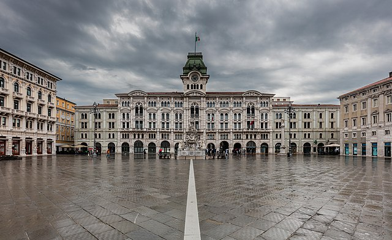
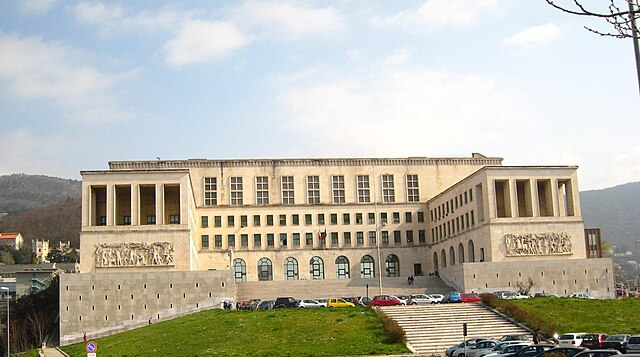

<html>
<head>

</head>
<body>
<h1>SONDAGGIO INGEGNERIA </h1>

Benvenuti su questo sito, creato  con la volontà di conoscere più accuratamente gli studenti di Ingegneria Informatica dell'Università di Trieste. Attraverso il sondaggio che troverete al link in fondo alla pagina, miriamo a raccogliere informazioni preziose e opinioni per ottenere un quadro generale su alcuni pareri degli studenti.

 

 La nostra bellissima città 

 
<a href="sondaggio.html">SONDAGGIO</a>

</body>
</html>
